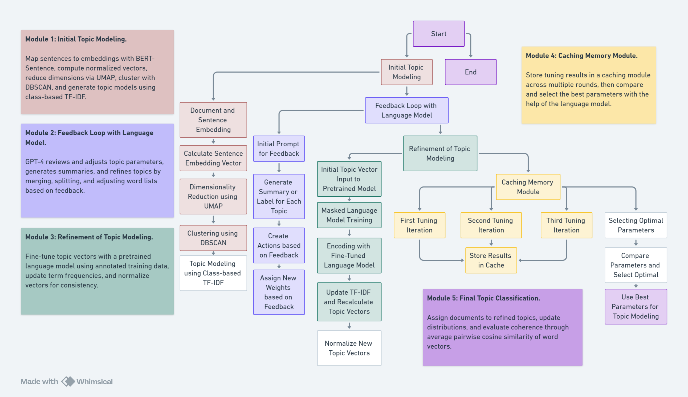

# AgenTopic: Topic Modeling with LLM-based Agent

## Overview

AgenTopic is an advanced topic modeling project that enhances traditional neural topic modeling by integrating an iterative feedback loop with a large language model (e.g., GPT-4) and a caching memory module. This approach optimizes and compares different parameters and topic outcomes, selecting the best parameters for modeling.

This project is specifically designed to perform topic modeling on psoriasis literature, based on the dataset from [psknlr.github.io](https://psknlr.github.io). It facilitates precise literature retrieval by combining information on titles, journals, publication years, abstracts, and topics.



## Features

- **Initial topic modeling with BERTopic**
- **Iterative refinement of topics using GPT-4 suggestions**
- **Fine-tuning language models based on new topics**
- **Evaluation of models using various metrics**
- **Selection of the optimal model with GPT-4 assistance**
- **Integration with psoriasis literature dataset from psknlr.github.io**

## Methods

1. **Initial Topic Modeling**
   - Document and Sentence Embedding
   - Dimensionality Reduction
   - Clustering
   - Topic Modeling

2. **Feedback Loop with Language Model**
   - Generate Topic Summaries and Labels
   - Create Actions Based on Feedback
   - Assign New Weights to Word Embeddings

3. **Refinement of Topic Modeling**
   - Fine-Tuning the Language Model
   - Recalculate Topic Vectors

4. **Caching Memory Module**
   - Multiple Tuning Iterations
   - Selecting Optimal Parameters

## Installation

```bash
pip install -r requirements.txt
```

## Usage

Provide detailed instructions on how to use the project, including examples and command-line usage.

## Psoriasis Literature Dataset

This project utilizes the psoriasis literature dataset from [psknlr.github.io](https://psknlr.github.io). Below is a live embed of the dataset:

<iframe src="https://psknlr.github.io" width="100%" height="500px"></iframe>

*Note: GitHub README files do not support iframe embeds. To view the dataset, please visit [psknlr.github.io](https://psknlr.github.io) directly.*

## Contributing

We welcome contributions from the community! Please follow these guidelines to contribute to AgenTopic:

1. Fork the repository.
2. Create a new branch (`git checkout -b feature/YourFeature`).
3. Commit your changes (`git commit -m 'Add some feature'`).
4. Push to the branch (`git push origin feature/YourFeature`).
5. Open a Pull Request.

Please ensure your contributions adhere to the project's coding standards and include appropriate tests.

## Contact

For any questions or suggestions, please contact [Yanlan Kang](Yanlan Kang:ylkang96engd@gmail.com).

## Citation

If you find this work useful in your research, please cite our repository:

```bibtex
@misc{AgenTopic,
  author = {FulPhil},
  title = {AgenTopic: Topic Modeling with LLM-based Agent},
  year = {2024},
  publisher = {GitHub},
  journal = {GitHub Repository},
  howpublished = {\url{https://github.com/pariskang/AgenTopic}}
}
        
